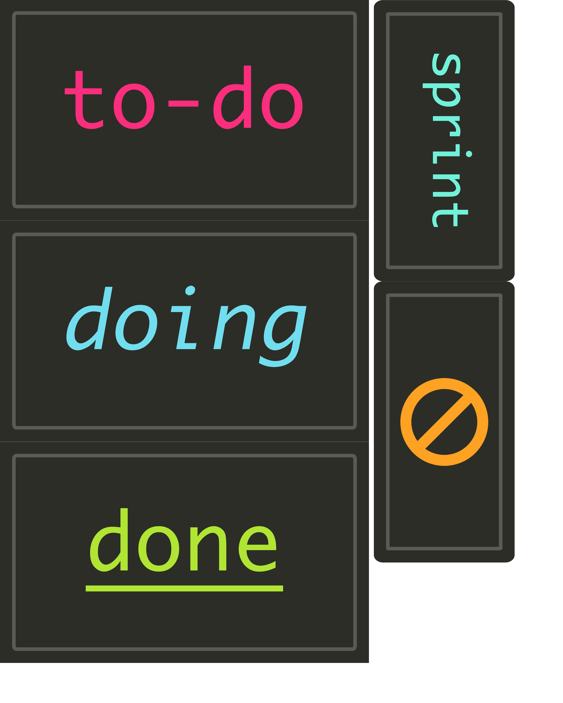
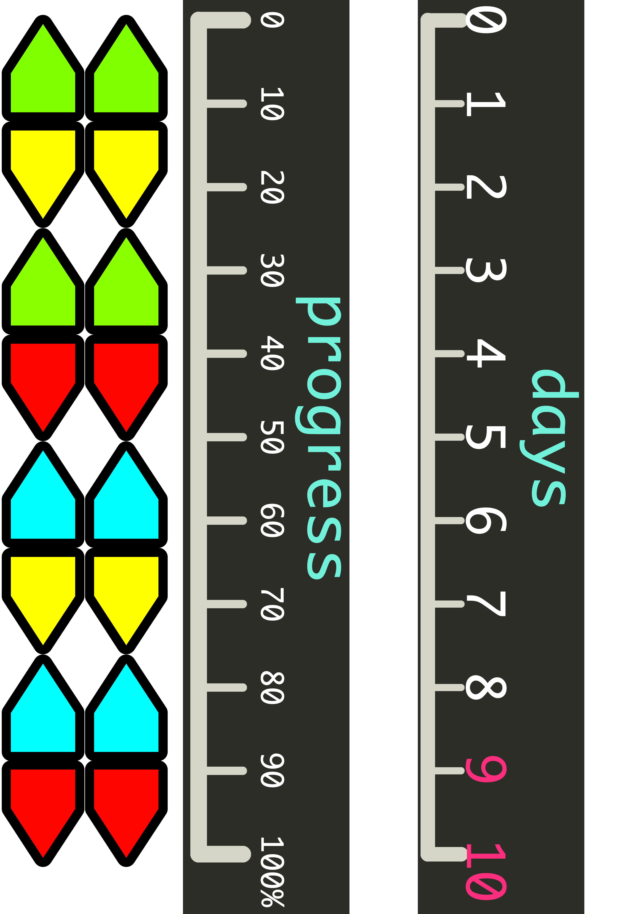
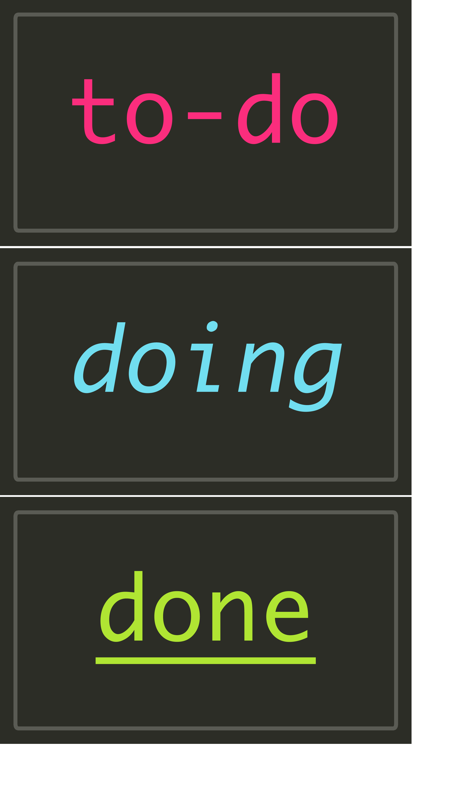
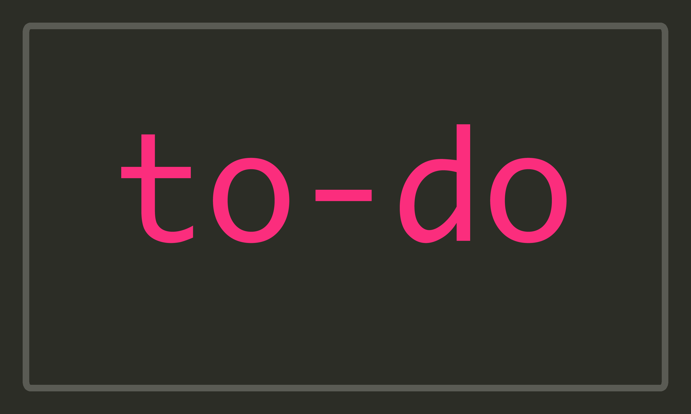
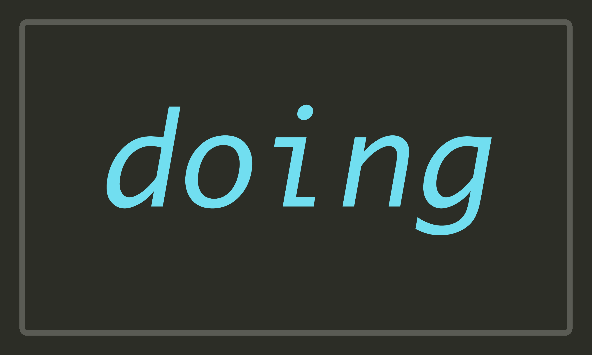
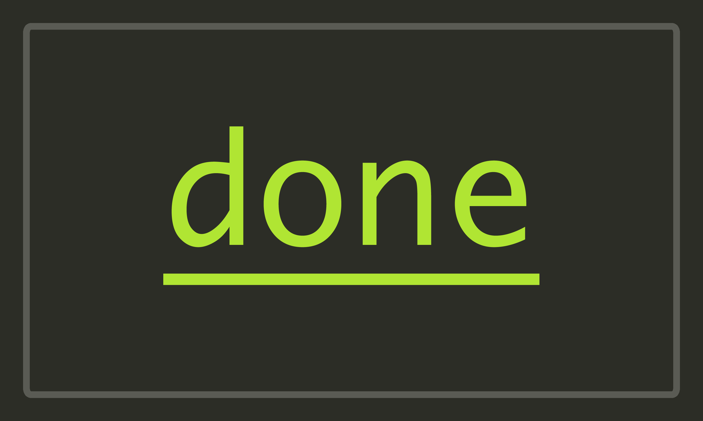
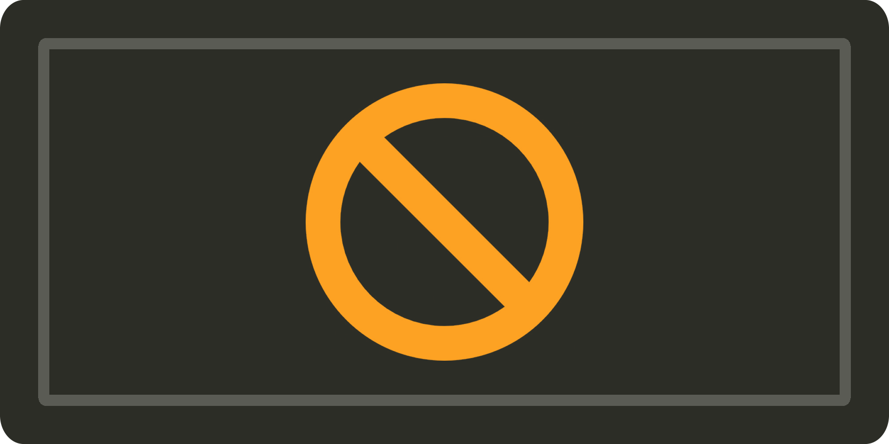

# kanbanokai
A monokai inspired kan-ban board for scrum sprints.

This is distributed under the [Apache 2.0 License](LICENSE.md)
Please consider giving this project a Star if you use any of these images!

----

----
